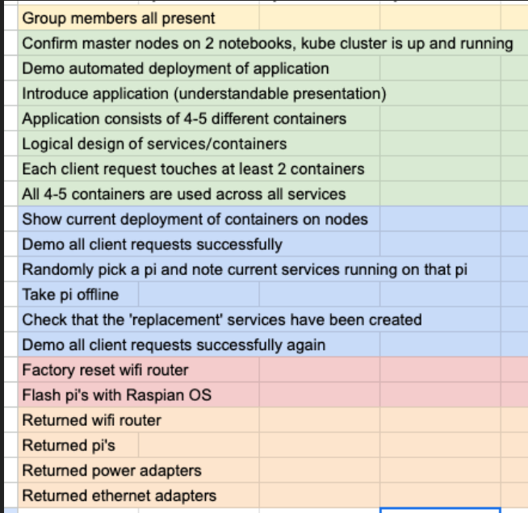

# mathops-docker-k8s
mathops-docker-k8sis a microservices-based web application for simple math operations, developed as part of the SDS 2023 project. It is designed to be easily deployed using Docker, Ansible, and Kubernetes for efficient container orchestration.

## 1) Connect Network

## 2) Install K3S by k3s-ansible 

follow this: [K3S-Ansible Instruction](./k3s-ansible/README.md)
## 3) Setup Kubernetes Cluster

#### Ref [Deploy Kubernetes](https://sumanta9090.medium.com/deploying-a-fastapi-application-on-kubernetes-a-step-by-step-guide-for-production-d74faac4ca36)

1. `kubectl apply -f k3s-ansible/deployment/deployment.yaml` to deploy the application

## Deploy Application

To deploy calculator application on your PC

```
$ kubectl apply -f k3s-ansible/deployment/deployment.yaml
```

### docker image
- client/frontend --> charnkij2035/sds-k8s-calculator:server-frontend-12
- server/calucalate --> charnkij2035/sds-k8s-calculator:server-calculate-12
- server/cache --> charnkij2035/sds-k8s-calculator:server-cache-12
- server/notification --> charnkij2035/sds-k8s-calculator:server-calculate-12

## Device Checklist

-   x Ethernet/WiFi Router TP- Link TL WR841N
-   4 x Raspberry Pi Kit
    -   Raspberry Pi 3 B+
    -   Power Adapter
    -   SD Card
    -   Ethernet Cable
    -   Ethernet Adapter and USB-C/USB-A Adapter as needed

## Demo on 20/11/2023

### The demo will be done on your own cluster

-   Demo **automatic deployment** of your application with all
    components available in your Github repo
-   Demo your application working with successful client
    requests, and demo that each client request is serviced by
    **2** or **more containers**
-   Demo `fault tolerance` in your application by `pulling each
Raspberry Pi offline`, one at a time. Client requests should
    be successful after containers are online.

## Rubric and hint

1.  Have your demo set up and **ready before your
    the start** of your demo **time slot**
2.  Demo **automatic deployment** of your application
    with all components available in your Github
    repo
3.  Demo your application working with successful
    **client requests**, and **demo that each client
    request is serviced by 2 or more containers**
4.  Demo `fault tolerance` in your application by
    pulling a Raspberry Pi offline (instructor will pick
    a random one). Client requests should be
    successful after containers are online.
5.  After demo, sign in and return all equipment
    -   Flash all Raspberry Pi’s with default Raspian
        OS
    -   Factory reset wireless router



#### _HELPFUL HINTS_

-   Use Ubuntu VM’s (at least 2 CPU cores) on your notebooks
    as Masters.
-   Make your very own Kubernetes cluster from Raspberry PI
-   https://medium.com/nycdev/k8s-on-pi-9cc14843d43
-   https://ubuntu.com/tutorials/how-to-kubernetes-cluster-on-raspberry-pi#1-overview
-   This links are a good starting point. Not every thing will
    work.
